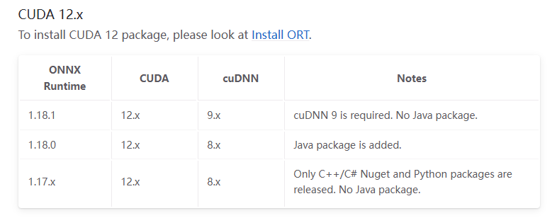
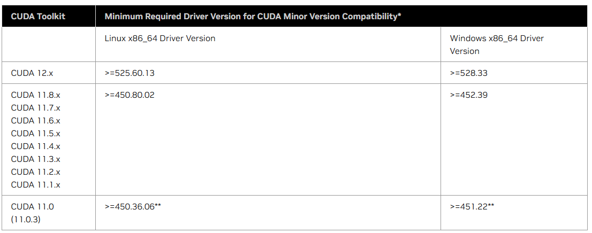

# LivePortait Windows 安装手册

## 安装环境

### 硬件

- CPU: 2核心及以上
- GPU: NVIDIA系列(可选)

### 软件

- 操作系统: Windows 10+
- 环境:
    - Anaconda/Miniconda
    - ffmpeg

## 安装流程

### 1. Anaconda/Miniconda 安装

1. 集成环境下载:

- anaconda下载地址: https://repo.anaconda.com/archive/

2. 安装完检查

```bash
    # 打开新的终端
    $ conda --version
    # conda 24.x.x
```

> anaconda 精简版本 miniconda下载地址: https://repo.anaconda.com/miniconda/

### 2. FFMPEG

多媒体框架软件下载: https://github.com/GyanD/codexffmpeg/releases

根据实际需求下载对应的build，教程使用 `ffmpeg-7.0.2-essentials_build.7z` 发行版。

1. 解压 `ffmpeg-7.0.2-essentials_build.7z` 至任意目录
2. 将 `ffmpeg-7.0.2-essentials_build/bin` 目录添加至系统环境变量
3. 安装完检查

```bash
    # 打开新的终端
    $ ffmpeg
    # ffmpeg version 7.0.2-essentials_build-www.gyan.dev Copyright (c) 2000-2024 the FFmpeg developers
    # built with gcc 13.2.0 (Rev5, Built by MSYS2 project)
```

### 3. Nvidia驱动

安装前需要注意 `Cuda`, `ONNX Runtime` 和 `cuDNN` 版本对应关系: https://onnxruntime.ai/docs/execution-providers/CUDA-ExecutionProvider.html#install



#### 3.1 cuda 安装

1. VC++发行版本下载地址
    - arm https://aka.ms/vs/17/release/vc_redist.arm64.exe
    - x86 https://aka.ms/vs/17/release/vc_redist.x86.exe
    - x64 https://aka.ms/vs/17/release/vc_redist.x64.exe

2. 先确认英伟达的驱动版本再选择对应的cuda版本，对应关系如图所示:



cuda版本下载地址: https://developer.nvidia.com/cuda-toolkit-archive

3. 安装完检查

```bash
    # 打开新的终端
    $ nvidia-smi
    # +---------------------------------------------------------------------------------------+
    # | NVIDIA-SMI 535.129.03             Driver Version: 535.129.03   CUDA Version: 12.2     |
    # |-----------------------------------------+----------------------+----------------------+
    # | GPU  Name                 Persistence-M | Bus-Id        Disp.A | Volatile Uncorr. ECC |
    # | Fan  Temp   Perf          Pwr:Usage/Cap |         Memory-Usage | GPU-Util  Compute M. |
    # |                                         |                      |               MIG M. |
    # |=========================================+======================+======================|
    # |   0  Quadro RTX 6000                Off | 00000000:3B:00.0 Off |                    0 |
    # | N/A   29C    P8              13W / 250W |      7MiB / 23040MiB |      0%      Default |
    # |                                         |                      |                  N/A |
    # +-----------------------------------------+----------------------+----------------------+
    # |   1  Quadro RTX 6000                Off | 00000000:AF:00.0 Off |                    0 |
    # | N/A   27C    P8              13W / 250W |      7MiB / 23040MiB |      0%      Default |
    # |                                         |                      |                  N/A |
    # +-----------------------------------------+----------------------+----------------------+

    # +---------------------------------------------------------------------------------------+
    # | Processes:                                                                            |
    # |  GPU   GI   CI        PID   Type   Process name                            GPU Memory |
    # |        ID   ID                                                             Usage      |
    # |=======================================================================================|
    # |    0   N/A  N/A      2393      G   /usr/lib/xorg/Xorg                            4MiB |
    # |    1   N/A  N/A      2393      G   /usr/lib/xorg/Xorg                            4MiB |
    # +---------------------------------------------------------------------------------------+
```

#### 3.2 cuDNN 安装

1. cudnn下载地址: https://developer.nvidia.com/cudnn-archive
2. 安装完检查

```bash
    # 打开新的终端
    $ nvcc -V
    # nvcc: NVIDIA (R) Cuda compiler driver
    # Copyright (c) 2005-2023 NVIDIA Corporation
    # Built on Mon_Apr__3_17:16:06_PDT_2023
    # Cuda compilation tools, release 12.1, V12.1.105
    # Build cuda_12.1.r12.1/compiler.32688072_0
```

### 4. 项目环境准备

#### 4.1 Python 环境

```bash
    # 打开新的终端
    $ conda create -n LivePortrait python==3.9.16
    $ conda activate LivePortrait
    $ python --version
    # Python 3.9.16
```

#### 4.2 LivePortrait 项目安装

1. 安装

```bash
    # 处于 LivePortrait 环境下

    $ git clone https://github.com/KwaiVGI/LivePortrait
    $ cd LivePortrait
    $ pip install -r requirements.txt
```

注意: numpy 版本在安装时默认为 `1.26.0` 如果升级为更高版本会导致项目运行失败。

2. 放置训练模型

将 `insightface` 和 `liveportrait` 这2个文件夹放置在根目录下的 `pretrained_weights` 中。

```bash
    # 文件目录结构
    ├── insightface
    │   └── models
    │       └── buffalo_l
    │           ├── 2d106det.onnx
    │           └── det_10g.onnx
    └── liveportrait
        ├── base_models
        │   ├── appearance_feature_extractor.pth
        │   ├── motion_extractor.pth
        │   ├── spade_generator.pth
        │   └── warping_module.pth
        ├── landmark.onnx
        └── retargeting_models
            └── stitching_retargeting_module.pth
```

> 下载地址: https://pan.baidu.com/s/1MGctWmNla_vZxDbEp2Dtzw?pwd=z5cn#list/path=%2F

#### 4.3 PyTorch 安装

1. 根据之前的 `nvcc -V` 来确定对应的torch安装, [Torch官网](https://pytorch.org/get-started/previous-versions/)

```bash
    # for CUDA 11.1
    $ pip install torch==1.10.1+cu111 torchvision==0.11.2 torchaudio==0.10.1 -f https://download.pytorch.org/whl/cu111/torch_stable.html
    # for CUDA 11.8
    $ pip install torch==2.3.0 torchvision==0.18.0 torchaudio==2.3.0 --index-url https://download.pytorch.org/whl/cu118
    # for CUDA 12.1
    $ pip install torch==2.3.0 torchvision==0.18.0 torchaudio==2.3.0 --index-url https://download.pytorch.org/whl/cu121
    # ...
```

2. 安装完检查

```bash
    # 处于 LivePortrait 环境下

    # 查看 torch 版本
    $ python -c "import torch;print(torch.__version__)"
    # 2.3.0

    # 查看 torch-gpu 是否可用
    $ python -c "import torch;print(torch.cuda.is_available())"
    # True
```

#### 4.4 ONNX Runtime 安装

在 4.1 中会默认安装 onnxruntime-gpu 版本，如果和 nvidia 的驱动不匹配则会导致项目无法运行，此时需要重新安装 onnxruntime 库，如果系统版本的cuda为11.8则可直接忽略该步骤。

1. 卸载原有的库

```bash
    $ pip uninstall onnxruntime-gpu
```

2. 安装版本

cpu 版本

```bash
    $ pip install onnxruntime
```

gpu版本，默认对应 cuda 11.8

```bash
    $ pip install onnxruntime-gpu
```

gpu版本，支持 cuda 12.x

```bash
    $ pip install onnxruntime-gpu --extra-index-url https://aiinfra.pkgs.visualstudio.com/PublicPackages/_packaging/onnxruntime-cuda-12/pypi/simple/
```

3. 安装完检查

```bash
    # 处于 LivePortrait 环境下

    $ python -c "import onnxruntime;print(onnxruntime.__version__)"
    # 1.18.0
```

## 运行项目

进入 LivePortrait 的根目录，执行以下指令:

```bash
    # For Linux and Windows users
    $ python inference.py
```

如果执行成功则会在当前目录下生成一个名为 `animations` 的目录，输出的结果将存储在该目录下。
